# Object Detection in an Urban Environment

## Data

For this project, we will be using data from the [Waymo Open dataset](https://waymo.com/open/).

[OPTIONAL] - The files can be downloaded directly from the website as tar files or from the [Google Cloud Bucket](https://console.cloud.google.com/storage/browser/waymo_open_dataset_v_1_2_0_individual_files/) as individual tf records. We have already provided the data required to finish this project in the workspace, so you don't need to download it separately.

## Structure

### Data

The data you will use for training, validation and testing is organized as follow:
```
/home/workspace/data/waymo
	- training_and_validation - contains 97 files to train and validate your models
    - train: contain the train data (empty to start)
    - val: contain the val data (empty to start)
    - test - contains 3 files to test your model and create inference videos
```
The `training_and_validation` folder contains file that have been downsampled: we have selected one every 10 frames from 10 fps videos. The `testing` folder contains frames from the 10 fps video without downsampling.

You will split this `training_and_validation` data into `train`, and `val` sets by completing and executing the `create_splits.py` file.


### Experiments
The experiments folder will be organized as follow:
```
experiments/
    - pretrained_model/
    - exporter_main_v2.py - to create an inference model
    - model_main_tf2.py - to launch training
    - reference/ - reference training with the unchanged config file
    - experiment0/ - create a new folder for each experiment you run
    - experiment1/ - create a new folder for each experiment you run
    - experiment2/ - create a new folder for each experiment you run
    - label_map.pbtxt
    ...
```

## Prerequisites

### Local Setup

For local setup if you have your own Nvidia GPU, you can use the provided Dockerfile and requirements in the [build directory](./build).

Follow [the README therein](./build/README.md) to create a docker container and install all prerequisites.

### Download and process the data

**Note:** ”If you are using the classroom workspace, we have already completed the steps in the section for you. You can find the downloaded and processed files within the `/home/workspace/data/preprocessed_data/` directory. Check this out then proceed to the **Exploratory Data Analysis** part.

The first goal of this project is to download the data from the Waymo's Google Cloud bucket to your local machine. For this project, we only need a subset of the data provided (for example, we do not need to use the Lidar data). Therefore, we are going to download and trim immediately each file. In `download_process.py`, you can view the `create_tf_example` function, which will perform this processing. This function takes the components of a Waymo Tf record and saves them in the Tf Object Detection api format. An example of such function is described [here](https://tensorflow-object-detection-api-tutorial.readthedocs.io/en/latest/training.html#create-tensorflow-records). We are already providing the `label_map.pbtxt` file.

You can run the script using the following command:
```
python download_process.py --data_dir {processed_file_location} --size {number of files you want to download}
```

You are downloading 100 files (unless you changed the `size` parameter) so be patient! Once the script is done, you can look inside your `data_dir` folder to see if the files have been downloaded and processed correctly.

### Classroom Workspace

In the classroom workspace, every library and package should already be installed in your environment. You will NOT need to make use of `gcloud` to download the images.

## Instructions

### Exploratory Data Analysis

You should use the data already present in `/home/workspace/data/waymo` directory to explore the dataset! This is the most important task of any machine learning project. To do so, open the `Exploratory Data Analysis` notebook. In this notebook, your first task will be to implement a `display_instances` function to display images and annotations using `matplotlib`. This should be very similar to the function you created during the course. Once you are done, feel free to spend more time exploring the data and report your findings. Report anything relevant about the dataset in the writeup.

Keep in mind that you should refer to this analysis to create the different spits (training, testing and validation).


### Create the training - validation splits
In the class, we talked about cross-validation and the importance of creating meaningful training and validation splits. For this project, you will have to create your own training and validation sets using the files located in `/home/workspace/data/waymo`. The `split` function in the `create_splits.py` file does the following:
* create three subfolders: `/home/workspace/data/train/`, `/home/workspace/data/val/`, and `/home/workspace/data/test/`
* split the tf records files between these three folders by symbolically linking the files from `/home/workspace/data/waymo/` to `/home/workspace/data/train/`, `/home/workspace/data/val/`, and `/home/workspace/data/test/`

Use the following command to run the script once your function is implemented:
```
python create_splits.py --data-dir /home/workspace/data
```

### Edit the config file

Now you are ready for training. As we explain during the course, the Tf Object Detection API relies on **config files**. The config that we will use for this project is `pipeline.config`, which is the config for a SSD Resnet 50 640x640 model. You can learn more about the Single Shot Detector [here](https://arxiv.org/pdf/1512.02325.pdf).

First, let's download the [pretrained model](http://download.tensorflow.org/models/object_detection/tf2/20200711/ssd_resnet50_v1_fpn_640x640_coco17_tpu-8.tar.gz) and move it to `/home/workspace/experiments/pretrained_model/`.

We need to edit the config files to change the location of the training and validation files, as well as the location of the label_map file, pretrained weights. We also need to adjust the batch size. To do so, run the following:
```
python edit_config.py --train_dir /home/workspace/data/train/ --eval_dir /home/workspace/data/val/ --batch_size 2 --checkpoint /home/workspace/experiments/pretrained_model/ssd_resnet50_v1_fpn_640x640_coco17_tpu-8/checkpoint/ckpt-0 --label_map /home/workspace/experiments/label_map.pbtxt
```
A new config file has been created, `pipeline_new.config`.

### Training

You will now launch your very first experiment with the Tensorflow object detection API. Move the `pipeline_new.config` to the `/home/workspace/experiments/reference` folder. Now launch the training process:
* a training process:
```
python experiments/model_main_tf2.py --model_dir=experiments/reference/ --pipeline_config_path=experiments/reference/pipeline_new_default.config
```
Once the training is finished, launch the evaluation process:
* an evaluation process:
```
python experiments/model_main_tf2.py --model_dir=experiments/reference/ --pipeline_config_path=experiments/reference/pipeline_new_default.config --checkpoint_dir=experiments/reference/
```

**Note**: Both processes will display some Tensorflow warnings, which can be ignored. You may have to kill the evaluation script manually using
`CTRL+C`.

To monitor the training, you can launch a tensorboard instance by running `python -m tensorboard.main --logdir experiments/reference/`. You will report your findings in the writeup.

### Improve the performances

Most likely, this initial experiment did not yield optimal results. However, you can make multiple changes to the config file to improve this model. One obvious change consists in improving the data augmentation strategy. The [`preprocessor.proto`](https://github.com/tensorflow/models/blob/master/research/object_detection/protos/preprocessor.proto) file contains the different data augmentation method available in the Tf Object Detection API. To help you visualize these augmentations, we are providing a notebook: `Explore augmentations.ipynb`. Using this notebook, try different data augmentation combinations and select the one you think is optimal for our dataset. Justify your choices in the writeup.

Keep in mind that the following are also available:
* experiment with the optimizer: type of optimizer, learning rate, scheduler etc
* experiment with the architecture. The Tf Object Detection API [model zoo](https://github.com/tensorflow/models/blob/master/research/object_detection/g3doc/tf2_detection_zoo.md) offers many architectures. Keep in mind that the `pipeline.config` file is unique for each architecture and you will have to edit it.

**Important:** If you are working on the workspace, your storage is limited. You may to delete the checkpoints files after each experiment. You should however keep the `tf.events` files located in the `train` and `eval` folder of your experiments. You can also keep the `saved_model` folder to create your videos.


### Creating an animation
#### Export the trained model
Modify the arguments of the following function to adjust it to your models:


```
python experiments/exporter_main_v2.py --input_type image_tensor --pipeline_config_path experiments/reference/pipeline_new.config --trained_checkpoint_dir experiments/reference/ --output_directory experiments/reference/exported/
```

This should create a new folder `experiments/reference/exported/saved_model`. You can read more about the Tensorflow SavedModel format [here](https://www.tensorflow.org/guide/saved_model).

Finally, you can create a video of your model's inferences for any tf record file. To do so, run the following command (modify it to your files):
```
python inference_video.py --labelmap_path label_map.pbtxt --model_path experiments/reference/exported/saved_model --tf_record_path data/test/segment-12200383401366682847_2552_140_2572_140_with_camera_labels.tfrecord --config_path experiments/reference/pipeline_new_default.config --output_path animation.gif
```


## Submission Writeup

### Project overview

In this Project we are going to detect object from street camera data, mainly cars, pedestrians and cyclists. The import ance of object especially when it comes to self driving car systems is 
next to functionality of course safety. It is important to be able to detect all kinds of other traffic participants in time no matter the weather conditions in order to plan for collision avoidance. 
Just as a human driver with human eyes an automatic system should be able to detect any important street component just as well if not better than a human to make self driving cars a viable choice for
the future. 


### Set up
In order to run this you need the following dependencies / libraries 

```
pip install numpy
pip install pandas
pip install seaborn
pip install tensorflow
pip install pandas
```
In order to get the Tensorflow working please also refer to this 
https://tensorflow-object-detection-api-tutorial.readthedocs.io/en/latest/install.html

This project was run on the Udacity provided Workspace in order to run it locally please return to the notes above provided by Udacity 

In order to run everything please refer to the notes above and make sure to change the name of the config file to 
new_config_final found in ./experiments/reference/


### Dataset
#### Dataset analysis
First dive into an exploratory data analysis. To run it yourself please run the Explore Data Analysis.ipynb. 
First look at a selected number (in our case 10) images to get a feel for the kind of images. In order to visualize the data a function was written to display them along with 
the according bounding box in the respective color. Red for cars, blue for pedestrians and green for cyclists. 

A sample can be seen below

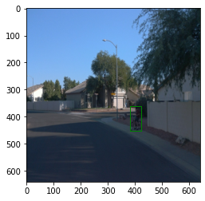
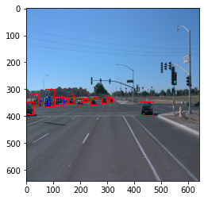
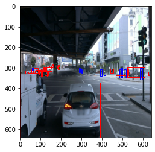

In addition to this we explore some statistical data by randomly picking 50k images from the dataset and looking at the total number of 
the class representation in those samples. 

We found the overall distribution to be such 

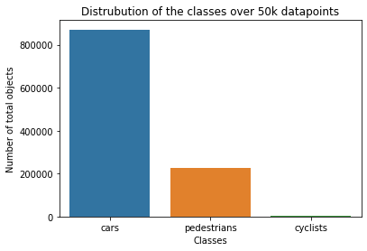


We also take a look at the number of objects of each class present in each image and display those in the graphs below 

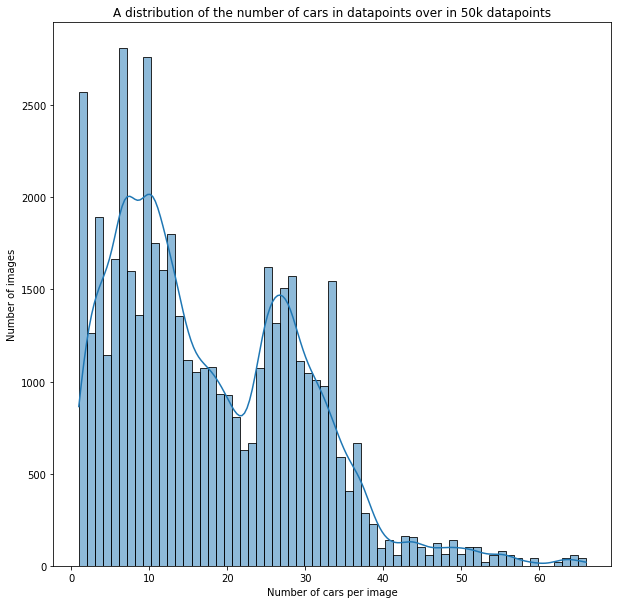

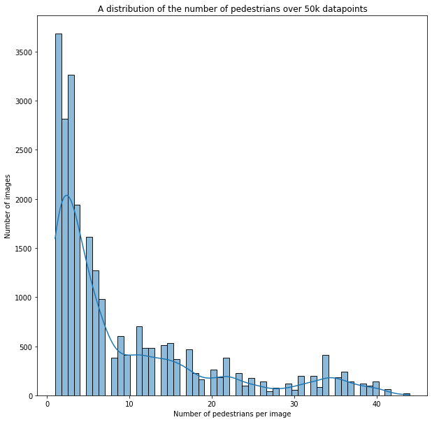

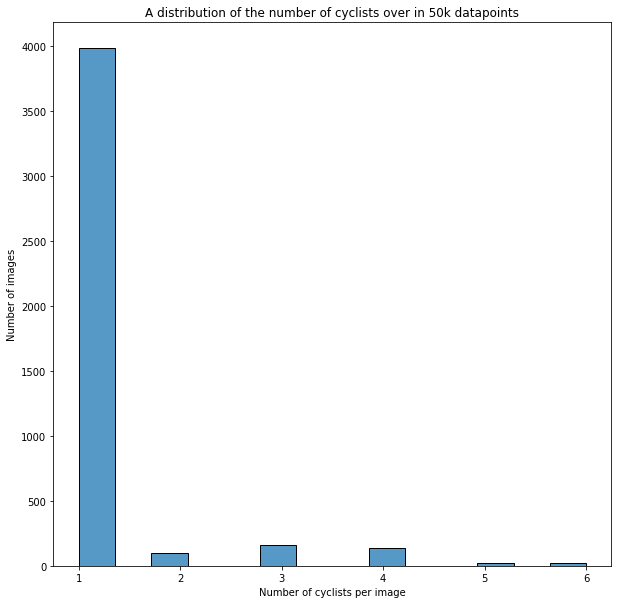


#### Cross validation
100 tfrecord files are used in this project, which are randomly shuffled to avoid bias. The data is split into a classic training, testing and validation split. So the model is 
improved according to the test set but ultimate the performance is measured on the validation split. 75% of the Data is used for training, 10% for testing and 15% for validation. 
This ratio should hopefully avoid overfitting along with the applied augmentations. 
In the best case the final model with tuned hyperparameters should be validated by a k-fold cross validation. The data is shuffled with each process so data in the training set is interchanged with test/validation set and vice versa. For more information please refer to https://machinelearningmastery.com/k-fold-cross-validation/


### Training
#### Reference experiment
This section should detail the results of the reference experiment. It should includes training metrics and a detailed explanation of the algorithm's performances.

In order to improve the result additional augmentation methods are explored such as 

Contrast augmentation


Color/hue augmentation
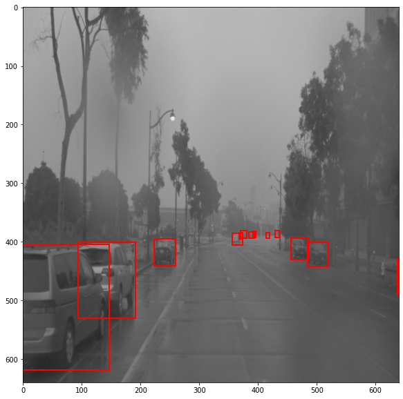

Brightness augmentation
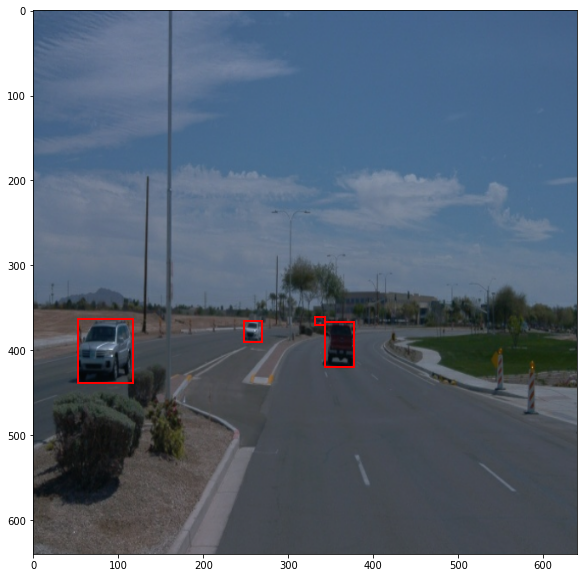

These augmentations are done to increase the performance of the model and avoid overfitting. They were chosen after close inspection of the dataset, by observing the various light and weather conditions i believe will make the overall data more robust. Brightness and contrast can simulate a very foggy condition or a scene at night. 

By using these additional augmentation and tweaking of the learning rate and warm-up rate from 
a default of 

```  
Batchsize = 2
learning_rate_base: 0.04
total_steps: 2000
warmup_learning_rate: 0.013333
warmup_steps: 200
```

to 

```  
Batchsize = 4
learning_rate_base: 0.005
total_steps: 2000
warmup_learning_rate: 0.0005
warmup_steps: 600
```  

The amounts of epoch for the final model are around 2500, we don't see much more improvement after that but the model 
then slowly goes into overfitting. For the default setting we chose to interrupt the training after 2000 epoch as no significant improvement could
be observed whatsoever.

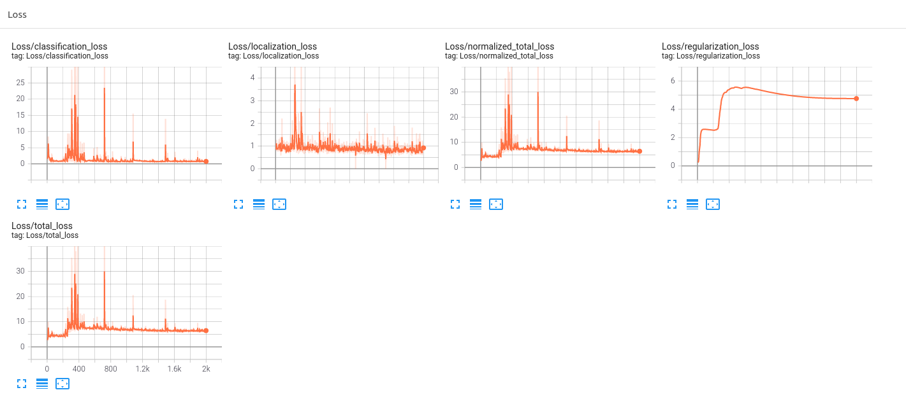

We manage to increase the initial accuracy by a mile and achieve a loss decrease faster proven by the tensorboard below. 

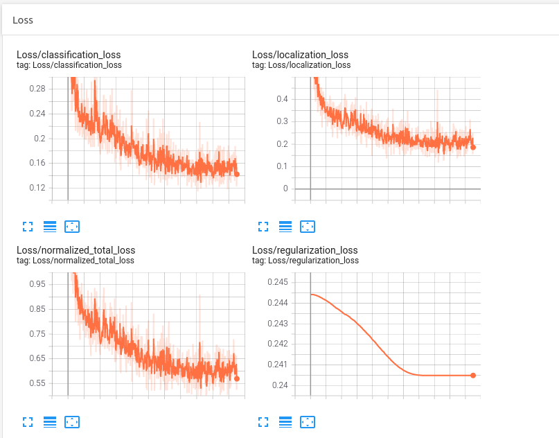

Also precision and recall for the final model can be observed below:


Those values for the default model were extremely close to 0 and pretty meaningless 

The final result can be observed in this video 

https://user-images.githubusercontent.com/40666055/207930079-149c2c86-b5ef-436b-8959-2974aa9dc602.mp4


#### Thoughts to improve on the reference
Definitely more time could be spend on hyperparameter tuning or choosing a more complex model but due to limited computing resources this remains to be future work.
Argue along these lines we could also use the entire dataset waymo dataset instead of a subset that we chose of this project 
and try to augment the dataset so we do not have such a cross class imbalance anymore. 
With enough computation time it could be considered to switch to a more complex model than the resnet50. 
Transformer networks have been shown to be outstanding concerning tasks like this but are extremely computationally expensive. 

